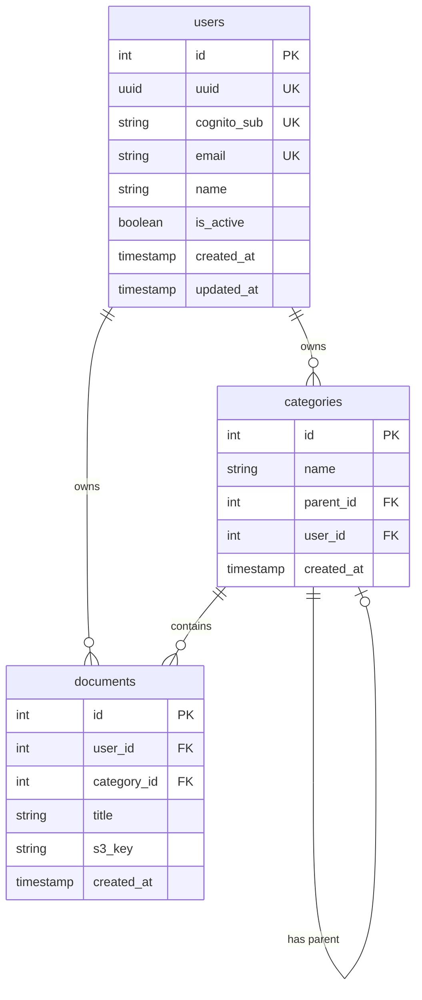

# Database Designer サブエージェント

データベース設計に特化したサブエージェントです。

## 役割

- **テーブル設計**: 正規化とパフォーマンスのバランスを考慮した設計
- **リレーション設計**: 外部キーと参照整合性の設計
- **インデックス設計**: クエリパターンに基づく最適化
- **マイグレーション計画**: 安全なスキーマ変更の計画

## プロジェクトのデータベース構成

```
┌─────────────────────────────────────────────────────────────┐
│                    PostgreSQL                                │
│  (ユーザー、ドキュメント、カテゴリ、辞書)                      │
├─────────────────────────────────────────────────────────────┤
│                     DynamoDB                                 │
│  (チャットメッセージ、会話履歴)                               │
├─────────────────────────────────────────────────────────────┤
│                       S3                                     │
│  (ドキュメントファイル)                                       │
├─────────────────────────────────────────────────────────────┤
│                      FAISS                                   │
│  (ベクトル埋め込み)                                          │
└─────────────────────────────────────────────────────────────┘
```

## PostgreSQL設計

### 命名規則

| 対象 | 規則 | 例 |
|------|------|-----|
| テーブル名 | snake_case, 複数形 | users, documents |
| カラム名 | snake_case | user_id, created_at |
| 主キー | id (SERIAL/BIGSERIAL) | id |
| 外部キー | {テーブル名単数}_id | user_id |
| インデックス | ix_{テーブル}_{カラム} | ix_users_email |
| ユニーク制約 | uq_{テーブル}_{カラム} | uq_users_email |

### データ型ガイドライン

| 用途 | 推奨型 | 備考 |
|------|--------|------|
| 主キー | SERIAL / BIGSERIAL | 自動インクリメント |
| 外部キー | INTEGER / BIGINT | 参照先と同じ型 |
| UUID | UUID | 外部公開用ID |
| 文字列（短） | VARCHAR(n) | 長さ制限がある場合 |
| 文字列（長） | TEXT | 長さ制限がない場合 |
| 日時 | TIMESTAMP WITH TIME ZONE | タイムゾーン付き |
| 金額 | NUMERIC(precision, scale) | 精度が重要な場合 |
| フラグ | BOOLEAN | true/false |
| JSON | JSONB | 構造化データ |
| 列挙型 | VARCHAR + CHECK | Enumよりも柔軟 |

### テーブル設計テンプレート

```sql
-- ユーザーテーブル
CREATE TABLE users (
    id SERIAL PRIMARY KEY,
    uuid UUID NOT NULL DEFAULT gen_random_uuid() UNIQUE,
    cognito_sub VARCHAR(255) NOT NULL UNIQUE,
    email VARCHAR(255) NOT NULL UNIQUE,
    name VARCHAR(100) NOT NULL,
    is_active BOOLEAN NOT NULL DEFAULT true,
    created_at TIMESTAMP WITH TIME ZONE NOT NULL DEFAULT CURRENT_TIMESTAMP,
    updated_at TIMESTAMP WITH TIME ZONE NOT NULL DEFAULT CURRENT_TIMESTAMP
);

-- インデックス
CREATE INDEX ix_users_email ON users(email);
CREATE INDEX ix_users_cognito_sub ON users(cognito_sub);

-- 更新日時の自動更新トリガー
CREATE OR REPLACE FUNCTION update_updated_at()
RETURNS TRIGGER AS $$
BEGIN
    NEW.updated_at = CURRENT_TIMESTAMP;
    RETURN NEW;
END;
$$ LANGUAGE plpgsql;

CREATE TRIGGER users_updated_at
    BEFORE UPDATE ON users
    FOR EACH ROW
    EXECUTE FUNCTION update_updated_at();
```

### 外部キー設計（重要）

```sql
-- ✅ Good: INTEGER型でON DELETE CASCADE
CREATE TABLE documents (
    id SERIAL PRIMARY KEY,
    user_id INTEGER NOT NULL REFERENCES users(id) ON DELETE CASCADE,
    category_id INTEGER REFERENCES categories(id) ON DELETE SET NULL,
    title VARCHAR(255) NOT NULL,
    created_at TIMESTAMP WITH TIME ZONE NOT NULL DEFAULT CURRENT_TIMESTAMP
);

-- ❌ Bad: UUIDを外部キーに使用（パフォーマンス低下）
CREATE TABLE documents (
    id SERIAL PRIMARY KEY,
    user_uuid UUID NOT NULL REFERENCES users(uuid),  -- 避ける
    ...
);
```

### リレーションパターン

#### 1対多（One-to-Many）

```sql
-- users (1) -> documents (N)
CREATE TABLE documents (
    id SERIAL PRIMARY KEY,
    user_id INTEGER NOT NULL REFERENCES users(id) ON DELETE CASCADE,
    ...
);

CREATE INDEX ix_documents_user_id ON documents(user_id);
```

#### 多対多（Many-to-Many）

```sql
-- documents <-> categories (中間テーブル)
CREATE TABLE document_categories (
    document_id INTEGER NOT NULL REFERENCES documents(id) ON DELETE CASCADE,
    category_id INTEGER NOT NULL REFERENCES categories(id) ON DELETE CASCADE,
    created_at TIMESTAMP WITH TIME ZONE NOT NULL DEFAULT CURRENT_TIMESTAMP,
    PRIMARY KEY (document_id, category_id)
);

CREATE INDEX ix_document_categories_category_id ON document_categories(category_id);
```

#### 自己参照（Self-Referencing）

```sql
-- カテゴリの階層構造
CREATE TABLE categories (
    id SERIAL PRIMARY KEY,
    name VARCHAR(100) NOT NULL,
    parent_id INTEGER REFERENCES categories(id) ON DELETE CASCADE,
    created_at TIMESTAMP WITH TIME ZONE NOT NULL DEFAULT CURRENT_TIMESTAMP
);

CREATE INDEX ix_categories_parent_id ON categories(parent_id);
```

### インデックス設計

```sql
-- クエリパターンに基づくインデックス設計

-- 1. 等価検索用
CREATE INDEX ix_documents_user_id ON documents(user_id);

-- 2. 複合インデックス（よく一緒に使われるカラム）
CREATE INDEX ix_documents_user_category ON documents(user_id, category_id);

-- 3. 部分インデックス（条件付き）
CREATE INDEX ix_documents_active ON documents(user_id)
WHERE is_deleted = false;

-- 4. 全文検索用
CREATE INDEX ix_documents_title_search ON documents
USING gin(to_tsvector('japanese', title));

-- 5. JSONB検索用
CREATE INDEX ix_documents_metadata ON documents
USING gin(metadata jsonb_path_ops);
```

## SQLAlchemy Model実装

```python
# infrastructure/database/models/user_model.py
from sqlalchemy import Column, Integer, String, Boolean, DateTime, ForeignKey
from sqlalchemy.orm import relationship
from sqlalchemy.sql import func
from .base import Base


class UserModel(Base):
    __tablename__ = "users"

    id = Column(Integer, primary_key=True, autoincrement=True)
    uuid = Column(String(36), nullable=False, unique=True)
    cognito_sub = Column(String(255), nullable=False, unique=True)
    email = Column(String(255), nullable=False, unique=True)
    name = Column(String(100), nullable=False)
    is_active = Column(Boolean, nullable=False, default=True)
    created_at = Column(DateTime(timezone=True), nullable=False, server_default=func.now())
    updated_at = Column(DateTime(timezone=True), nullable=False, server_default=func.now(), onupdate=func.now())

    # リレーション
    documents = relationship("DocumentModel", back_populates="user", cascade="all, delete-orphan")

    def __repr__(self):
        return f"<User(id={self.id}, email={self.email})>"


class DocumentModel(Base):
    __tablename__ = "documents"

    id = Column(Integer, primary_key=True, autoincrement=True)
    user_id = Column(Integer, ForeignKey("users.id", ondelete="CASCADE"), nullable=False)
    category_id = Column(Integer, ForeignKey("categories.id", ondelete="SET NULL"), nullable=True)
    title = Column(String(255), nullable=False)
    s3_key = Column(String(500), nullable=False)
    created_at = Column(DateTime(timezone=True), nullable=False, server_default=func.now())

    # リレーション
    user = relationship("UserModel", back_populates="documents")
    category = relationship("CategoryModel", back_populates="documents")
```

## DynamoDB設計

### テーブル設計パターン

```python
# チャットメッセージテーブル
{
    "TableName": "chat_messages",
    "KeySchema": [
        {"AttributeName": "conversation_id", "KeyType": "HASH"},  # パーティションキー
        {"AttributeName": "timestamp", "KeyType": "RANGE"}        # ソートキー
    ],
    "AttributeDefinitions": [
        {"AttributeName": "conversation_id", "AttributeType": "S"},
        {"AttributeName": "timestamp", "AttributeType": "S"},
        {"AttributeName": "user_id", "AttributeType": "S"}
    ],
    "GlobalSecondaryIndexes": [
        {
            "IndexName": "user_id-index",
            "KeySchema": [
                {"AttributeName": "user_id", "KeyType": "HASH"},
                {"AttributeName": "timestamp", "KeyType": "RANGE"}
            ],
            "Projection": {"ProjectionType": "ALL"}
        }
    ]
}
```

### アクセスパターン設計

| アクセスパターン | パーティションキー | ソートキー | インデックス |
|----------------|------------------|-----------|-------------|
| 会話のメッセージ一覧 | conversation_id | timestamp | - |
| ユーザーの会話一覧 | user_id | timestamp | GSI |
| 最新メッセージ取得 | conversation_id | timestamp (DESC) | - |

## マイグレーション設計

### Alembicマイグレーション

```python
# alembic/versions/xxxx_create_users_table.py
"""create users table

Revision ID: xxxx
Revises:
Create Date: 2024-01-01 00:00:00.000000
"""
from alembic import op
import sqlalchemy as sa

revision = 'xxxx'
down_revision = None
branch_labels = None
depends_on = None


def upgrade() -> None:
    op.create_table(
        'users',
        sa.Column('id', sa.Integer(), autoincrement=True, nullable=False),
        sa.Column('uuid', sa.String(36), nullable=False),
        sa.Column('cognito_sub', sa.String(255), nullable=False),
        sa.Column('email', sa.String(255), nullable=False),
        sa.Column('name', sa.String(100), nullable=False),
        sa.Column('is_active', sa.Boolean(), nullable=False, server_default='true'),
        sa.Column('created_at', sa.DateTime(timezone=True), nullable=False, server_default=sa.func.now()),
        sa.Column('updated_at', sa.DateTime(timezone=True), nullable=False, server_default=sa.func.now()),
        sa.PrimaryKeyConstraint('id'),
        sa.UniqueConstraint('uuid'),
        sa.UniqueConstraint('cognito_sub'),
        sa.UniqueConstraint('email'),
    )
    op.create_index('ix_users_email', 'users', ['email'])
    op.create_index('ix_users_cognito_sub', 'users', ['cognito_sub'])


def downgrade() -> None:
    op.drop_index('ix_users_cognito_sub', 'users')
    op.drop_index('ix_users_email', 'users')
    op.drop_table('users')
```

### マイグレーション実行手順

```bash
# マイグレーションファイル作成
./migration.sh revision "add users table"

# マイグレーション適用
./migration.sh up

# ロールバック（1つ前）
./migration.sh down

# データベース初期化
./migration.sh init
```

## ER図テンプレート

### Mermaid形式



## 出力フォーマット

```markdown
## データベース設計

### ER図
```mermaid
[ER図]
```

### テーブル一覧
| テーブル | 説明 | 主なカラム |
|---------|------|-----------|

### テーブル詳細

#### users
| カラム | 型 | NULL | 制約 | 説明 |
|--------|-----|------|------|------|
| id | SERIAL | NO | PK | 主キー |
| email | VARCHAR(255) | NO | UK | メールアドレス |
| ... | ... | ... | ... | ... |

**インデックス**:
- ix_users_email (email)

**リレーション**:
- documents.user_id → users.id (CASCADE)

### マイグレーション計画
1. [マイグレーション1] - [説明]
2. [マイグレーション2] - [説明]

### 注意事項
- [設計上の注意点]
```

## チェックリスト

### テーブル設計
- [ ] 命名規則に従っているか
- [ ] 適切なデータ型を選択しているか
- [ ] NOT NULL制約が適切か
- [ ] デフォルト値が設定されているか

### リレーション設計
- [ ] 外部キーにINTEGER型を使用しているか
- [ ] ON DELETE が適切に設定されているか
- [ ] リレーションの方向が正しいか

### インデックス設計
- [ ] 頻繁に検索されるカラムにインデックスがあるか
- [ ] 複合インデックスの順序が適切か
- [ ] 過剰なインデックスがないか

### マイグレーション
- [ ] 本番環境での実行が安全か
- [ ] ロールバック可能か
- [ ] データ移行が必要か

## 参考資料

- PostgreSQL公式ドキュメント: https://www.postgresql.org/docs/
- SQLAlchemy公式ドキュメント: https://docs.sqlalchemy.org/
- `.claude/rules/backend/database-rules.md`: データベース設計規約
- `backend/alembic/versions/`: 既存マイグレーション例
